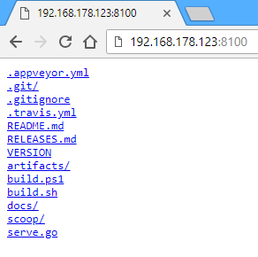

serve
=====

[](https://travis-ci.org/philippgille/serve/branches) [](https://ci.appveyor.com/project/philippgille/serve/branch/master) [](https://goreportcard.com/report/github.com/philippgille/serve) [](https://github.com/philippgille/serve/releases)

`serve` starts a simple temporary static file server in your current directory and prints your IP address to share with colleagues.

It's based on [this Gist](https://gist.github.com/paulmach/7271283/2a1116ca15e34ee23ac5a3a87e2a626451424993) by [Paul Mach](https://github.com/paulmach).

Contents
--------

- [Install](#install)
    - [Windows](#windows)
    - [macOS](#macos)
    - [Linux](#linux)
- [Use](#use)
    - [Example](#example)
- [Build](#build)

Install
-------

With Go installed:

`go get github.com/philippgille/serve`

> Note: Requires your `$GOPATH/bin` directory to be in your `PATH`, which is usually the case.

Without Go installed:

### Windows

The easiest way is to use the package manager [Scoop](http://scoop.sh/).

I can highly recommend it. If you haven't installed it yet, you can do so with:

`iex (new-object net.webclient).downloadstring('https://get.scoop.sh')`

Then, to install `serve`, just run:

`scoop install serve`

If you don't want to use Scoop, you can download the binary from the [releases](https://github.com/philippgille/serve/releases) and install `serve` manually. See [Manual Installation](https://github.com/philippgille/serve/docs#manual-installation) for details.

### macOS

There's no [Homebrew](https://brew.sh/) "formulae" yet, but you can download the binary from the [releases](https://github.com/philippgille/serve/releases) and install `serve` manually. See [Manual Installation](https://github.com/philippgille/serve/docs#manual-installation) for details.

### Linux

There will be a [Snap](https://snapcraft.io/) package soon™. Until then you can download the binary from the [releases](https://github.com/philippgille/serve/releases) and install `serve` manually. See [Manual Installation](https://github.com/philippgille/serve/docs#manual-installation) for details.

Use
---

```bash
$ serve -h
Usage of serve:
  -d string
        The directory of static file to host (default ".")
  -p string
        Port to serve on (default "8100")
  -t    Test / dry run (just prints the interface table)
  -v    Print the version
```

Hit `Ctrl+C` in the terminal to stop the server.

### Example

```bash
~/path/to/servable/files$ serve

Serving "." on all network interfaces (0.0.0.0) on HTTP port: 8100

Local network interfaces and their IP address so you can pass one to your colleagues:

   Interface    |  IPv4 Address   | IPv6 Address   
----------------|-----------------|----------------
lo              | 127.0.0.1       | ::1
eth0            |                 | 
wlan0           | 192.168.178.123 | fe80::e7b:fdaf:ae5d:3cfa
virbr0          | 192.168.122.1   | 
br-8ef347e8a4e9 | 172.22.0.1      | fe80::42:c9ff:fed3:35a
docker_gwbridge | 172.21.0.1      | 
docker0         | 172.17.0.1      | fe80::42:c6cf:fe3d:a554
veth0d522f4     |                 | fe80::307a:7fcf:fe3d:cba4

You probably want to share:
http://192.168.178.123:8100
```

When opening the URL `http://192.168.178.123:8100` in a browser you see the directory you're serving. For example:



Build
-----

To build `serve` by yourself:

1. [Install Go](https://golang.org/doc/install)
2. `cd` into the root directory of this repository
3. Execute: `go build`

> Note: The binaries in GitHub Releases are shrinked with additional Go linker flags and UPX

To also make `serve` available as command in other directories:

1. Add `$GOPATH/bin` to your `PATH` if you haven't done that already when installing Go
2. Execute: `go install`

There are also build scripts for Windows and Linux for creating release artifacts (shrinked binaries for Windows, macOS and Linux):

- Windows: `.\build.ps1`
- Linux: `./build.sh`
