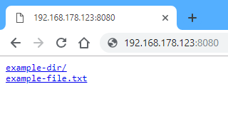

serve
=====

[](https://travis-ci.org/philippgille/serve/branches) [](https://ci.appveyor.com/project/philippgille/serve/branch/master) [](https://goreportcard.com/report/github.com/philippgille/serve) [](https://github.com/philippgille/serve/releases)

`serve` starts a simple temporary static file server in your current directory and prints your IP address to share with colleagues.

It's based on [a Gist](https://gist.github.com/paulmach/7271283/2a1116ca15e34ee23ac5a3a87e2a626451424993) by [Paul Mach](https://github.com/paulmach).

Contents
--------

- [Install](#install)
    - [Windows](#windows)
    - [macOS](#macos)
    - [Linux](#linux)
- [Use](#use)
    - [Example](#example)
- [Build](#build)
    - [Packages](#packages)

Install
-------

With Go installed:

`go get github.com/philippgille/serve`

> Note: Requires your `$GOPATH/bin` directory to be in your `PATH`, which is usually the case.

Without Go installed:

### Windows

The easiest way is to use the package manager [Scoop](http://scoop.sh/).

I can highly recommend it. If you haven't installed it yet, you can do so with:

`iex (new-object net.webclient).downloadstring('https://get.scoop.sh')`

Then, to install `serve`, just run:

`scoop install serve`

Another option is [Chocolatey](https://chocolatey.org/).

If you haven't installed it yet, you can do so in an *administrative* shell with:

`Set-ExecutionPolicy Bypass -Scope Process -Force; iex ((New-Object System.Net.WebClient).DownloadString('https://chocolatey.org/install.ps1'))`

Then, to install `serve`, just run:

`choco install serve --source https://www.myget.org/F/serve/api/v2`

If you don't want to use Scoop or Chocolatey, you can download the binary from the [releases](https://github.com/philippgille/serve/releases) and install `serve` manually. See [Manual Installation](https://github.com/philippgille/serve/tree/master/docs#manual-installation) for details.

### macOS

The easiest way is to use the package manager [Homebrew](https://brew.sh/).

It's the most popular package manager on macOS. If you haven't installed it yet, you can do so with:

`/usr/bin/ruby -e "$(curl -fsSL https://raw.githubusercontent.com/Homebrew/install/master/install)"`

Then, to install `serve`, just run:

`brew tap philippgille/tap`  
`brew install serve`

Or in a single command:

`brew install philippgille/tap/serve`

If you don't want to use Homebrew, you can download the binary from the [releases](https://github.com/philippgille/serve/releases) and install `serve` manually. See [Manual Installation](https://github.com/philippgille/serve/tree/master/docs#manual-installation) for details.

### Linux

The easiest way is to use the package manager [Snap](https://snapcraft.io/).

It's already installed on Ubuntu 16.04 and later. On Ubuntu 14.04 you can install it with:

`sudo apt install snapd`

For other Linux distributions check [Install snapd](https://docs.snapcraft.io/core/install).

Then, to install `serve`, just run:

`sudo snap install serve`

You can also have a look at the description in the Snap Store on [https://snapcraft.io/serve](https://snapcraft.io/serve).

> Note: Due to restrictions by Snap, `serve` can only serve files in the user's `$HOME` directory.

If you don't want to use Snap, you can download the binary from the [releases](https://github.com/philippgille/serve/releases) and install `serve` manually. See [Manual Installation](https://github.com/philippgille/serve/tree/master/docs#manual-installation) for details.

Use
---

```bash
$ serve -h
Usage of serve:
  -d string
        The directory of static file to host (default ".")
  -p string
        Port to serve on (default "8100")
  -t    Test / dry run (just prints the interface table)
  -v    Print the version
```

Press `Ctrl+C` in the terminal to stop the server.

### Example

```bash
~/path/to/servable/files$ serve

Serving "." on all network interfaces (0.0.0.0) on HTTP port: 8100

Local network interfaces and their IP address so you can pass one to your colleagues:

      Interface      |  IPv4 Address   |              IPv6 Address
---------------------|-----------------|----------------------------------------
lo                   | 127.0.0.1       | ::1
eth0                 |                 | 
wlan0                | 192.168.178.123 | fe80::e7b:fdaf:ae5d:3cfa
virbr0               | 192.168.122.1   | 
br-8ef347e8a4e9      | 172.22.0.1      | fe80::42:c9ff:fed3:35a
docker_gwbridge      | 172.21.0.1      | 
docker0              | 172.17.0.1      | fe80::42:c6cf:fe3d:a554
veth0d522f4          |                 | fe80::307a:7fcf:fe3d:cba4

You probably want to share:
http://192.168.178.123:8100
```

When opening the URL `http://192.168.178.123:8100` in a browser you see the directory you're serving. For example:



Build
-----

To build `serve` by yourself:

1. [Install Go](https://golang.org/doc/install)
2. `cd` into the root directory of this repository
3. Execute: `go build`

> Note: The binaries in GitHub Releases are shrinked with additional Go linker flags and UPX

To also make `serve` available as command in other directories:

1. Add `$GOPATH/bin` to your `PATH` if you haven't done that already when installing Go
2. Execute: `go install`

There are also build scripts for Windows and Linux for creating release artifacts (shrinked binaries for Windows, macOS and Linux):

- Windows: `build/build.ps1`
- Linux: `build/build.sh`

> Note: They require Go and UPX to be installed

To build with a Docker container:

`docker run --rm -v ${PWD}:/go/src/github.com/philippgille/serve -w /go/src/github.com/philippgille/serve golang build/build.sh noupx`  

### Packages

For Scoop and Homebrew no packages need to be built. They use "manifests"/"formulae" and the binaries from GitHub Releases.

For releasing a new version, they need to be updated here:

- Scoop: [https://github.com/lukesampson/scoop/blob/master/bucket/serve.json](https://github.com/lukesampson/scoop/blob/master/bucket/serve.json)
- Homebrew: [https://github.com/philippgille/homebrew-tap/blob/master/serve.rb](https://github.com/lukesampson/scoop/blob/master/bucket/serve.json)

For Snap a Git hook is set up in the Snapcraft dashboard to automatically build a new Snap on every commit, so for releasing a new version the file in *this* repository needs to be updated:

- Snap: [https://github.com/philippgille/serve/blob/master/snap/snapcraft.yaml](https://github.com/philippgille/serve/blob/master/snap/snapcraft.yaml)

The Snap package can also be built manually, for example with this script which utilizes Docker:

- Windows: `build\build-snap-with-docker.ps1`
- Linux: `build/build-snap-with-docker.sh`

The Chocolatey packages can be built with this script:

- Windows: `build\build-chocolatey.ps1`
